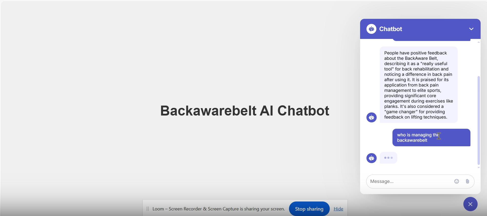

# Website RAG Assistant with Openai-agents

A FastAPI-based intelligent assistant that answers questions using a vector store. Powered by OpenAI agent tools with a simple frontend.



## Features

- Conversational assistant for benefits Q&A
- Uses vector search (RAG) from preloaded content
- Frontend served via FastAPI static files
- REST API with `/ask` endpoint
- Fully async agent handling

## Create Website Knowledge (No Code)

You can easily convert website content into LLM-friendly text without writing any code by using the following tools:

- 🔥 [Firecrawl.dev](https://www.firecrawl.dev) – Crawl websites visually
- 🧠 [llmstxt.firecrawl.dev](https://llmstxt.firecrawl.dev) – Convert web content into clean text chunks

## Uploading Your Vector Store to OpenAI

To use your own vector store with this assistant, follow these steps:

### Step 1: Go to OpenAI Vector Store UI

Visit: [https://platform.openai.com/storage/vector_stores](https://platform.openai.com/storage/vector_stores)

> Make sure you're signed in to your OpenAI account.

### Step 2: Upload Your Data

1. Click on the **"Create vector store"** button.
2. Give it a **name**.
3. Click **"Upload files"** and choose your `.pdf`, `.txt`, `.md`, or other supported documents.
4. Wait for processing to complete. You’ll see a status like “Ready” once the upload is successful.

### Step 3: Copy the Vector Store ID

Once created:

1. Find your vector store in the list.
2. Click on the three dots `⋮` or open its details.
3. Copy the **Vector Store ID** (looks like `vs_6868f43e68b48191905129c5a089c159`).

### Step 4: Paste the ID in Your Code

Open your `main.py` and locate this section:

```python
file_search_tool = FileSearchTool(
    max_num_results=5,
    vector_store_ids=["<YOUR_VECTOR_STORE_ID_HERE>"],
)
```

## Requirements

Dependencies are managed in `requirements.txt`. Example:

```bash
uvicorn
fastapi
pydantic
python-dotenv
openai
```

---

## Project Structure

```
Website-rag-openai-agent/
│
├── frontend/             # Static HTML/CSS files
├── main.py               # FastAPI app + agent logic
├── backup/               # Misc. files
├── .env                  # Environment variables (OpenAI keys, etc.)
├── requirements.txt      # Python dependencies
├── README.md             # You're here!
└── ...
```

## Setup Instructions (with `uv` and virtualenv)

1. **Install [`uv`](https://github.com/astral-sh/uv)** (recommended over pip):

   ```bash
   curl -Ls https://astral.sh/uv/install.sh | sh
   ```
2. **Create and activate virtual environment**:

   ```bash
   uv init project-name
   uv venv
   source .venv/bin/activate  # On Windows: .venv\Scripts\activate
   ```
3. **Install dependencies**:

   ```bash
   uv pip install -r requirements.txt
   ```
4. **Run the app**:

   ```bash
   uvicorn main:app --reload
   ```

## API Endpoints

| Method | Endpoint | Description                     |
| ------ | -------- | ------------------------------- |
| GET    | `/`    | Serves frontend HTML            |
| POST   | `/ask` | Accepts query, returns response |

## Sample Request

**POST** `/ask`

```json
{
  "query": "What are the benefits of this product?"
}
```

## Contributing

If you’d like to contribute, feel free to fork the repo and open a pull request with your improvements!

## License

This project is open-source and available under the MIT License.

Made with ❤️ by [Jawad Ali]([https://www.linkedin.com/in/b/](https://www.linkedin.com/in/jawad-ali-yousafzai-742a76356/))
